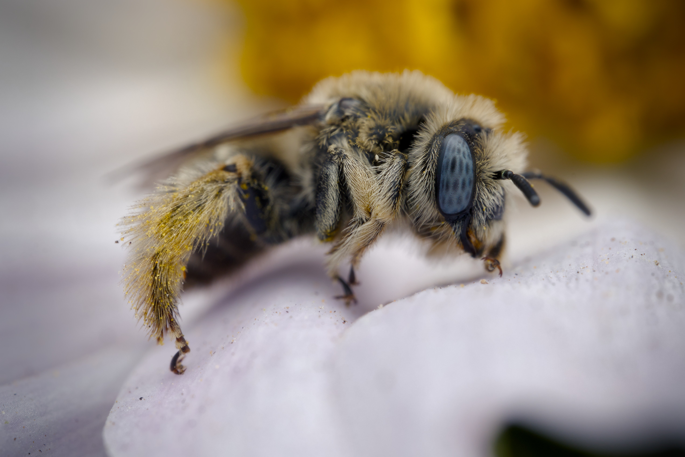

A bee resting on a flower. I came across this little bee toward the end of the day. I believe it is some sort of longhorn bee. I'm not sure if it was asleep but it was not moving for a few minutes. Even after it started moving a bit I was able to take advantage and get several close up shots before it flew off. 